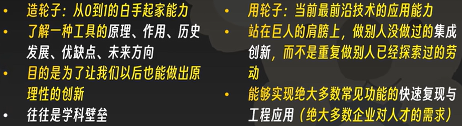

AI时代应该如何学习新知识？

AI时代人才竞争力完全不取决于脑子里死记硬背的知识有多少！

1.把握学科概念和行业整体框架的能力

2.提出问题、解决问题的能力

3.了解自己知识体系内的已知和未知

4.对已知部分实践的自信（只要...就能....）

---
AI时代老师扮演什么角色？

AI时代任何一个细分领域的具体知识，AI都比专业老师更专业！

1.师傅领进门，修行靠个人

2.系统、全面的技术架构介绍

3.充足的训练和实践资源

4.引导学生的学习和研究方向，让学生能在感兴趣的领域钻研

5.告诉学生还可以怎么样做进一步提升

---

AI时代如何学习、应用工程工具？

辩证的看待“造轮子”和“用轮子”

 

是否能充分利用现有资源，决定了你在大多数场景下的综合水平

对某一领域或工具的快速学习方法：

1.知道一个东西能干什么

2.设想使用这个东西的最佳方法

3.去寻找这种最佳方法的实现（示例代码、库封装、标准件等）

而不是从看说明书开始