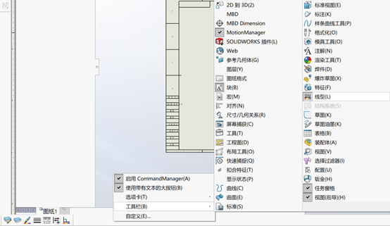
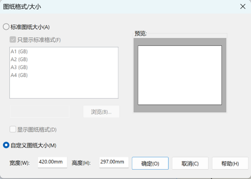
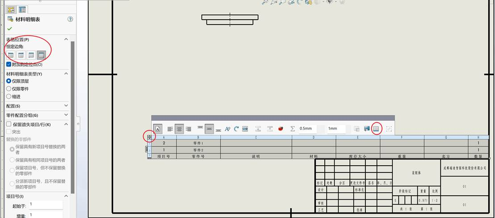
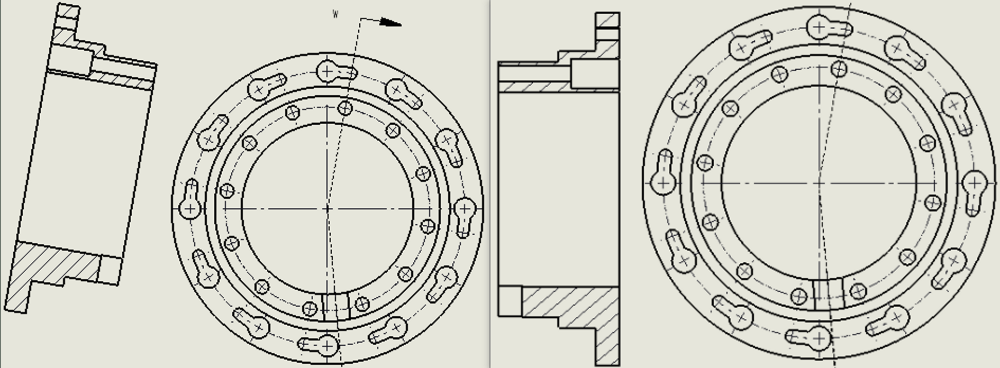
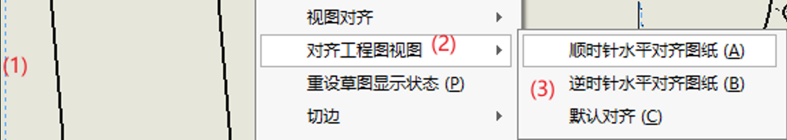
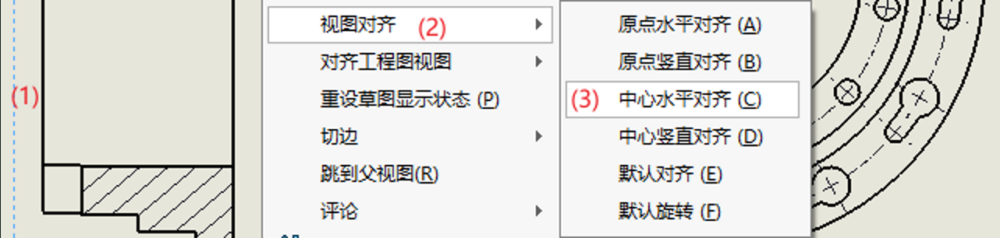

# 0.软件安装

推荐使用较新版本，这里使用的是SolidWorks2020 SP5.0

# 1.SolidWorks基础知识

## 1.1.概念

零件：是SolidWorks的基本组件

装配体：由零件或称为子装配体的其他装配体组成

模型：定义其边线、面和曲面的3D几何体

3D设计：使用SolidWorks设计零件时，从草图到最终结果，创建的都是3D模型。可根据3D模型生成2D工程图，或生成由零件或子装配体组成的配合零部件以生成3D装配体。可生成3D装配体的2D工程图。

基于零部件：对零件所做的任何更改都会反映到所有相关的工程图或装配体中。

## 1.2.术语

| 序号 | 名称 | 说明                                                         |
| ---- | ---- | ------------------------------------------------------------ |
| 1    | 顶点 | 两条或多条线或边线相交的点。可在绘制草图和标注尺寸时选择     |
| 2    | 边线 | 两个或多个面相交并连接在一起的位置。可在绘制草图和标注尺寸时选择 |
| 3    | 原点 | 显示为两个蓝色箭头，代表模型的(0,0,0)坐标。当草图为激活状态时，草图原点显示为红色，代表草图的(0,0,0)坐标。可对模型原点添加尺寸和几何关系，但对草图原点则不能添加 |
| 4    | 飞机 | 平的构造几何体。可使用基准面添加2D草图、模型的剖面视图、拔模特征的中性面 |
| 5    | 面   | 定义模型形状或曲面形状的边界。可选择(平面的或非平面的)       |
| 6    | 轴   | 生成模型几何体、特征或阵列的直线。可使用交叉两个基准面等方式生成轴。SW以隐含方式为模型的每个圆锥面或圆柱面生成临时轴 |

# 1.模板定制

要使用SolidWorks出符合中国国家标准的工程图，需要定制设计模板，包括零件模板、装配体模板、工程图模板。往往更重视工程图模板，而忽视零件和装配体模板，其实三种模板是配套使用的，相互之间有关联。不能脱离零件和装配体模板，而孤立使用工程图模板。只有配套的一组模板共同使用才能实现自动填写标题栏与明细表。

参考：[Solidworks GB模板的定制.pdf (book118.com)](https://max.book118.com/html/2017/0616/115809834.shtm)

## 1.1 定制零件模板

### 1.1.1 新建零件

使用SolidWorks自带的零件模板

### 1.1.2 选项-文档属性

单位：自定义-毫米、公斤、秒；

材料属性：密度：0.00000785(7.85e-006)kg/mm3（钢铁密度）

​    目的是在没有指定材质时可按最常用的钢铁计算零件重量。

新建该零件模板时，文档属性重置了？

### 1.1.3 文件-属性-摘要信息-自定义

| 序号 | 属性名称 | 数值/文字表达    |
| ---- | -------- | ---------------- |
| 1    | 公司名称 | 填写             |
| 2    | 图样名称 |                  |
| 3    | 图样代号 |                  |
| 4    | 材料名称 | 选择“材料”       |
| 5    | 重量     | 选择“质量”       |
| 6    | 备注     | （材料明细表中） |

### 1.1.4 保存

到“自定义模板“文件夹，为“*.prtdot”文件。GB_Prt.PRTDOT

默认位置：C:\ProgramData\SOLIDWORKS\SOLIDWORKS 2020\templates

## 1.2 定制装配体模板

### 1.2.1 新建装配体

使用SolidWorks自带的装配体模板

### 1.2.2 选项-文档属性

单位：自定义-毫米、公斤、秒；

### 1.2.3 文件-属性-摘要信息-自定义

| 序号 | 属性名称 | 数值/文字表达                     |
| ---- | -------- | --------------------------------- |
| 1    | 公司名称 | 填写                              |
| 2    | 图样名称 |                                   |
| 3    | 图样代号 |                                   |
| 4    | 材料名称 | 装配体无材料，可填写“装配体/组件“ |
| 5    | 重量     | 选择“质量”                        |
| 6    | 备注     | （材料明细表中）                  |

### 1.2.4 保存

到“自定义模板“文件夹，为“*.asmdot”文件。GB_Asm.ASMDOT

默认位置：C:\ProgramData\SOLIDWORKS\SOLIDWORKS 2020\templates

## 1.3 定制工程图模板

 

打开“线型”工具条，在界面边框右键，选择“工具栏-线型”，可更改图层、线型。

常用图纸幅面有A0、A1、A2、A3、A4等，又有横向和竖向之分，需对每种图幅建立模板。

包括如下内容：

①图幅设定和图框

②标题栏

③链接的属性

④材料明细表定位点

⑤标注样式

### 1.3.1 新建工程图

使用SolidWorks自带的工程图模板

右键“图纸1-添加图纸“，自定义图纸大小

 

删除自带的工程图模板“图纸1“

右键“图纸2-属性“：图纸大小；比例1：1；投影类型第一视角

### 1.3.2 编辑图纸格式

在图纸中右键-“编辑图纸格式“

在草图工具，绘制两个矩形代表图纸的“纸边界线“和”图框线“

选择外侧矩形的左下角点，在PropertyManager的“控制顶点参数“定义坐标(0，0)，并固定

绘制对中符号，根据需要绘制图幅分区

按GB标注尺寸，设置线宽，使两个矩形完全约束

在“视图-隐藏/显示-注解“，被选中的尺寸灰色显示，ESC退出命令后被隐藏

### 1.3.3 绘制标题栏

根据GB尺寸绘制

一般注释，这些文字一般不变的，设置字体、字号等

动态链接属性注释

选择“注释-链接到属性“

A当前文件，①比例：选择“SW-图纸比例“、②阶段标记1：S、③共 张：1、④第 张：1

B此处发现的模型-图纸属性中指定的工程图视图，“公司名称、图样名称、图样代号、材料名称、重量“跟零件、装配体关联

### 1.3.4 设定材料明细表定位点

展开“图纸2-图纸格式-右键“材料明细表定位点-设定定位点”，进入编辑图纸格式状态，选择标题栏的右上角，设定完后，自动退出编辑图纸格式状态

### 1.3.5 设定标注样式

“选项-文档属性”，按GB设定

### 1.3.6 保存

到自定义模板“文件夹，为“*.drwdot”文件。GB_Drw_A3.DRWDOT

默认位置：C:\ProgramData\SOLIDWORKS\SOLIDWORKS 2020\templates

## 1.4 加载模板

“系统选项-文件位置-文件模板-添加-浏览自定义文件夹-确定”/将三种模板文件拷贝到系统默认位置

新建文件时，可看见自定义的模板

## 1.5 定制材料明细表

### 1.5.1 插入材料明细表

在装配体工程图中，选中视图，选择“注解-表格-材料明细表”，选择表格模板，勾选“附加到定位点”

### 1.5.2 设定明细表位置

点击明细表左上角选中，重新定位明细表位置到标题栏右上角，定义明细表表格标题在下

 

### 1.5.3 链接列属性

将各列链接到相应的属性

点击列上方选中此列，选中“列属性“，

| 序号 | 列类型（项目号），开始1，增量1，列标题改为序号               |
| ---- | ------------------------------------------------------------ |
| 代号 | 列类型（自定义属性），属性名称（图样代号），列标题改为代号   |
| 名称 | 列类型（自定义属性），属性名称（图样名称），列标题改为名称   |
| 数量 | 选择表格模板自带（怎么自定义）                               |
| 材料 | 列类型（自定义属性），属性名称（材料名称），列标题改为材料   |
| 重量 | 列类型（自定义属性），属性名称（重量），列标题改为重量       |
| 总重 | 列类型（方程式），点击方程式-在“=”右侧输入-选择列”数量“-输入“*”-选择列“重量“-确定，列标题改为总重 |
| 备注 | 列类型（自定义属性），属性名称（备注），列标题改为备注       |

选中一列，可左右拖动，调整位置

选中一列，可右键插入新列

双击列标题，可重新命名

### 1.5.4 格式化明细表

格式化明细表的各行高度与各列宽度

选中列/行，右键格式化，选择列宽/行高度，按GB输入尺寸，在分别锁定行高度、列宽

SW将GB中重量（单件、总计）简化成重量、总重

### 1.5.5 保存

保存表格模板，在表格区域内右键-另存为：GB_bom.sldbomtbt

默认位置：D:\APP\Solidworks 2020\SOLIDWORKS\lang\chinese-simplified，其中有许多模板

## 1.6 替换所需模板

画好的零件替换需要的模板

1.6.1、选择需要的模板，新建零件

1.6.2、点击菜单-插入-零件

1.6.3、浏览打开画好的零件，不可在图形界面点击鼠标

1.6.4、勾选“断开与原有零件的连接“，确定

​    “用于制造派生零件的模板拥有与基体零件不同的测量单位”，应该选“是“，基体零件是新建零件需要的模板

1.6.5、可删除特征树中多出的文件夹

1.6.6、导入“GB_零件文档属性“

# 问题1：Stp格式 转换为 装配体格式

先打开SolidWorks软件

再从SW中选择打开 .Stp格式文件

另存为装配体 格式，可将其中的零件选择保存在装配体内部，以精简文件目录，但是也易发生零件损坏因无外部独立文件而无法恢复的问题。

注意：直接双击打开Stp格式文件，不能成功保存为SW装配体

# 问题2：Toolbox零件转换为普通零件

参考：[如何将Toolbox零件转换为普通零件使用 - 知乎 (zhihu.com)](https://zhuanlan.zhihu.com/p/651784027)

1、系统选项——异型孔向导/Toolbox——“将此文件夹设为Toolbox零部件的默认搜索位置”取消

2、选择一个Toolbox库中的标准件，将其重命名后保存至本地

3、转化为普通零件属性，SOLIDWORKS Corp\SOLIDWORKS\Toolbox\data utilities\sldsetdocprop.exe，添加保存至本地的自定义Toolbox零件，并将属性状态改为“否”后更新状态

注：直接将保存至本地的Toolbox零件插入至装配体中，设计树中的零件图标样式不是普通零件样式，依旧是Toolbox零件的图标样式

# 问题3：旋转剖视图沿投影线倾斜设置与主视图水平对齐

 

右键-（剖视图）-视图对齐-解除对齐关系-

 

右键-（剖视图）-对齐工程图视图-按需对齐视图

 

右键-（剖视图）-视图对齐-中心水平对齐-（选择主视图）

 

# 渲染

1.建模后配置好材质(SW的材质带外观）

2.打开SW的PhotoView360插件，工具栏出现渲染工具

3.进入DisplayManager-->布景、光源与相机

4.右键相机-->添加相机，在左侧左键点击目标点/面，拖动相机调整位置，右侧会实时显示结果视图

5.视野可选择50mm标准(类似于人眼的视野，近大远小)、或者35mm广角(冲击力更强)

6.高宽比例(宽度：高度)可选择16：9

7.景深：选择的锁焦，左键点击模型上想要对焦的位置

8.点击确认，回到主视图(此时视图被锁定为相机视图)

9.若需要更改相机的属性，右键上面添加的相机，取消勾选“锁定相机”和“相机视图”，就可以重新附加材料，点击“编辑相机”，就可以重新更改相机的属性，若是要回到相机视图开始渲染，需要确保勾选“锁定相机”和“相机视图”

10.点击渲染工具-->选项，可勾选动态帮助，设置格式，设置渲染品质

11.点击预览窗口，查看渲染设置

12.点击最终渲染，等待完成，点击保存图像

# 运动算例

