参考：[什么?不会材料力学怎么做机械设计……1小时速通材料力学概念，不再做小白！ | 机械工程 | 结构设计 | 机电一体化 | 机械设计_哔哩哔哩_bilibili](https://www.bilibili.com/video/BV1S2uFzWE1d/?spm_id_from=333.1387.collection.video_card.click&vd_source=b6cd6dd41c0769968f58ce886d249f74)

理论力学研究刚体结构之间的力和运动关系(不考虑材料的变形和破坏问题)

材料力学研究梁、轴、杆等简单结构

弹性力学研究平面、空间中的板件受力特性

塑性力学研究塑性材料的特性

结构力学研究复杂杆、梁的受力和变形计算

# 0.为什么要学材料力学

材料的形状会对其力学性能产生影响。

在实际结构设计中，构件的强度、刚度等必然对构件的功能发挥有实际影响，不同材料也具有不同的属性(3d打印和激光切割地塑料件与金属加工件性能差距很大)，在产品设计中，需根据设计目标针对性地进行材料选择。避免设计的结构强度不足导致构件的功能出现问题，或者因为过设计导致不必要的成本增加。

# 1.材料力学的基本假设

1.1.线弹性：研究的材料均在弹性限度内，力与变形之间满足胡克定律

1.2.小变形：研究的材料变形量远小于原尺寸，因此忽略其对结构形状产生影响

​    基于此，许多问题可以线性化，降低计算量(如 $tanx = x$)。变形对结构影响不忽略的情况，需要求解非线性方程，一般使用计算机有限元软件进行迭代求解。

1.3.各向同性：研究的材料在各个方向的力学性能(强度、刚度等)均一致

​    弹性力学会考虑各向异性的弹性体计算；复合材料力学会关注异质各向异性复合材料的计算

# 2.材料力学基本概念

## 2.1.应力和应力状态

**==应力==**：用于描述材料内单位区域的受力大小，单位为Pa(力/面积)

​    正应力(拉伸、压缩应力)符号为$\sigma$

​    切应力(剪切)符号为$\tau$

​    描述材料性能常用单位为$MPa$和$GPa$

​    $1 N/mm^2 = 1 MPa$

应力状态：描述材料受到不同力的情况，如**==拉伸、压缩、弯曲、扭转、剪切==**

​    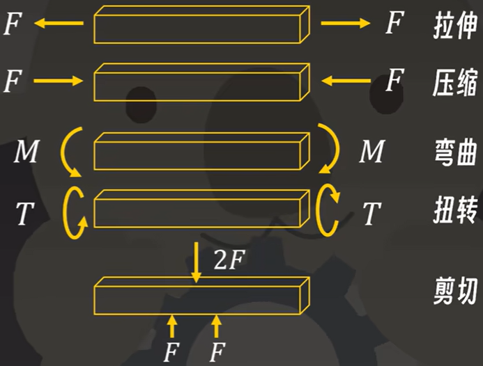 

## 2.2.==应变==

在应力状态下材料发生的微观变形

拉伸、压缩应变：定义为变形量与原长之比，符号为$\epsilon$，单位为1(无量纲)

​    $\epsilon = \frac{\Delta L}{L}$

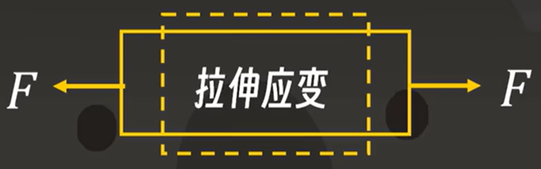 

剪切应变：定义为剪切状态下材料偏斜角的正切值，符号为$\gamma$，单位为1(无量纲)

​    $\gamma = tan \theta \approx \theta$

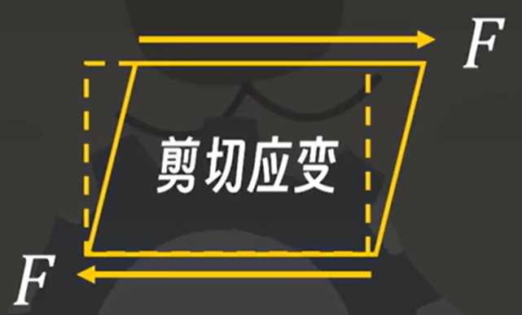 

## 2.3.材料性能：==刚度==属性(==模量==)

模量反映材料的刚度，模量越高，刚性越好，抵抗变形的能力就越强

杨氏模量(弹性模量)：描述材料在拉伸、压缩下，正应力与正应变的比值，符号为$E$，单位为$GPa$

​    $\sigma = E \epsilon$

胡克定律的弹性系数为弹性模量的宏观表征

剪切模量：描述材料在剪切下，切应力与切应变的比值，符号为$G$，单位为$GPa$

​    $\tau = G \gamma$

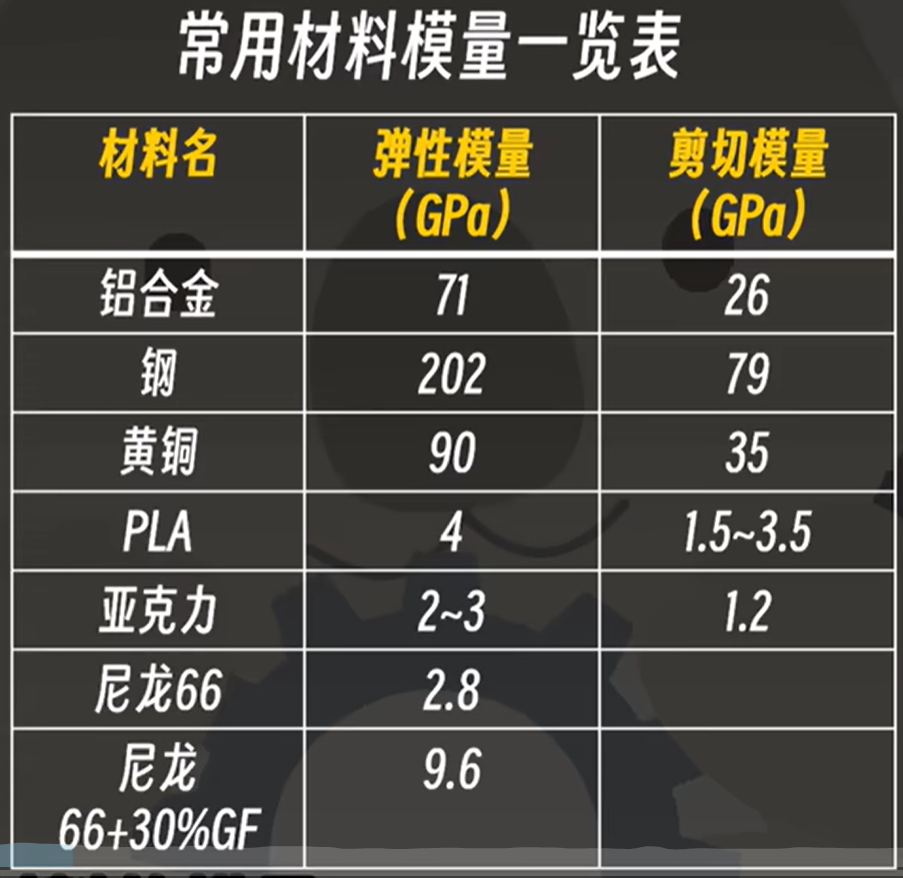 

## 2.4.材料性能：==强度==属性(强度)

材料强度越高，抵抗破坏的能力就越强

塑性材料受拉，先经历弹性阶段(变形后可恢复)，随后经历塑性阶段(变形后不可恢复)

将进入塑性阶段成为屈服，此时的应力记为屈服极限，记为$\sigma _ s $ (surrender)，用于表示塑性材料的强度，单位为$MPa$

脆性材料受拉，不经历明显的屈服阶段，直接断裂，将断裂点的应力记为强度极限，记为$\sigma _ b $ (breaking)，用于表示脆性材料的强度，单位为$MPa$

此外还有类似的剪切强度

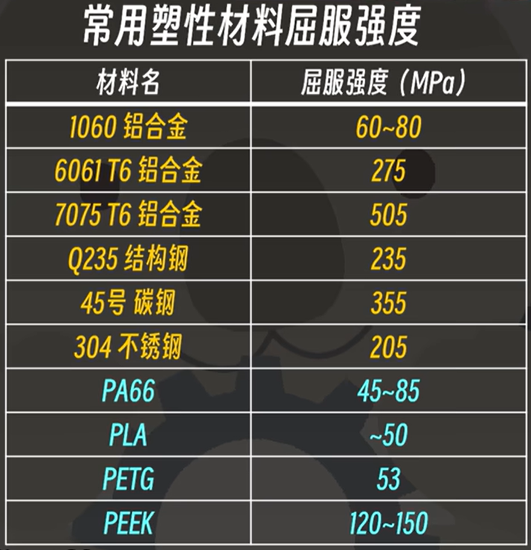 

## 2.5.强度计算：==安全因数==

实际的材料和结构因生产工艺等原因产生缺陷，不一定能完全达到理论强度。为了保障结构的强度安全，会将材料强度除以一个大于1的安全因数$n$，得到许用应力$[\sigma] [\tau]$，要求材料实际应力不得大于许用应力。

## 2.6.拉伸强度相关计算

例1：已知2020铝型材，材料为6063铝合金，米重0.47Kg，取安全因数为1.5，求最大轴向拉力？

> 解：
>
> 查资料得6063铝合金屈服应力170MPa
>
> 许用应力：$[\sigma] = \frac{\sigma _ s}{n} = \frac{170MPa}{1.5} = 131.6 MPa$
>
> 6063铝合金密度$2.7 g/cm^3$，米重0.47Kg
>
> 截面积：$A = \frac{w}{\rho} = \frac{4.7 g/cm}{2.7 g/cm^3} = 1.74 cm^2 = 174 mm^2$
>
> 容许最大轴向拉力：$F = \sigma A = 131.6 MPa \times 174 mm^2 =22898.4 N$

## 2.7.拉伸形变相关计算

拉伸状态为材料均匀受力的状态，因此直接基于前述关系方程即可求解

$\sigma = \frac{F}{A} = E \epsilon , \epsilon = \frac{\Delta L}{L} \to \Delta L = \frac{FL}{EA}$

压缩与拉伸的计算类似

例2：已知欧标2020铝型材，材料为6063铝合金，长度为1m，米重0.47Kg，取安全因数1.5，求容许最大轴向拉力下的变形量？

> 解：
>
> 6063铝型材弹性模量70GPa，截面积$174mm^2$，拉力22898.4N
>
> 变形量：$\Delta L = \frac{FL}{EA} = \frac{22898.4 N \times 1 m}{70 GPa \times 174 mm^2} = \frac{22898.4 N \times 1m}{70 \times 10^9 Pa \times 174 \times 10^{-6} m^2} = \frac{22898.4 N \times 1m}{70 \times 10^9 \frac{N}{m^2} \times 174 \times 10^{-6} m^2} = 0.00188 m = 1.88mm$

## 2.8.剪切相关计算

剪切与拉伸的计算类似

$\tau = \frac{F}{A} = G \gamma , \gamma = tan \theta \approx \theta$

例3：图示定滑轮组件常用来进行重物提升。已知定滑轮中央轴直径为6mm，材料为Q235结构钢，剪切强度为$\tau _ s = 140MPa$，由于跨距较小，忽略弯曲变形影响，求中轴因剪断而失效的负载大小？

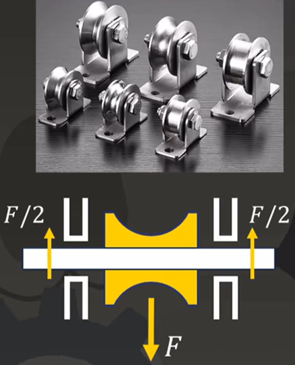 

> 解：
>
> 中央截面积：$A = \frac{1}{4} \pi d ^ 2 = \frac{1}{4} \times 3.14 \times 6 ^ 2 = 28.26 mm^2$
>
> 轴能承受的最大剪切力：$F_{max} = \tau _ s A = 140 \times 10^6 Pa \times 28.26 \times 10^{-6} m^2 = 3956.4 N$
>
> $F = 2 F _ {max} = 7912.8 N$

## 2.9.扭转相关计算

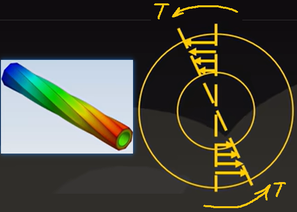 

扭转是材料受到绕着轴心旋转对称的扭矩作用，以轴心作为原点

扭转计算与拉压剪不同，扭转过程中材料不同点的形变情况是不同的，如何计算结构抗扭转的性能？

假设长为L，半径为r0的轴，受到扭转，两端的转角$\varphi = \varphi ' L$ (其中$\varphi '$为实际的角应变，单位长度的转角)

对截面上的一个小区域，其切应变量$\gamma$与其到轴心距离$\rho$成正比，则切应力为：$\tau = G \gamma =G \varphi ' \rho = \frac{G \rho \varphi}{L}$

截面上的小区域的剪切力：$dF =\tau dA = \frac{G \rho \varphi}{L} dA$

截面上的小区域对截面轴心产生的力矩：$dT = \tau \rho dA = \frac{G \rho ^2 \varphi}{L} dA$

两边积分得材料整体对轴心产生的力矩：$T =\int _ \rho \frac{G \rho ^2 \varphi}{L} dA = \frac{G \varphi}{L} (\int _ \rho \rho ^2 dA) = \frac{G \varphi}{L} I_p$

$\int _ \rho \rho ^2 dA$与截面形状有关，可用于衡量截面抗扭能力。

定义$I_p = \int _ \rho \rho ^2 dA$为截面的**==极惯性矩==**，**承受扭转载荷时，材料分布在离轴心越远的地方，抗扭能力越强**

$\varphi ' = \frac{T}{G I_p} , \varphi = \frac{T L}{G I_p}$

**$G I_p$用于反映结构的抗扭刚度**

最大应力点为离轴心最远处，应力为：$\tau (\rho) = \frac{T \rho}{I_p}$

当根据抗扭强度选择截面时，最大应力不仅与截面有关，也与半径有关

定义极惯性矩与截面最大半径比为**==抗扭截面系数==**：$W_t = \frac{I_p}{R}$

从而得到截面的最大应力计算公式：$\tau_{max} = \frac{T}{W_t}$

常见截面的极惯性矩和抗扭截面系数

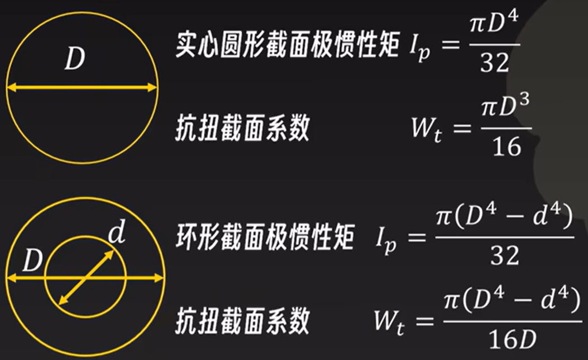 

考虑刚度时，抗扭刚度正比于直径四次方

考虑强度时，抗扭强度正比于直径三次方

例4：欲选用一种轴作为小车传动轴，有如下三种方案：a、φ5实心钢轴；b、φ6实心铝合金轴；c、φ8壁厚1mm空心铝合金管。讨论三者抗扭刚度？

> 解：
>
> a、φ5实心钢轴，剪切模量79GPa
>
> $I_p = \frac{\pi D^4}{32} = \frac{\pi \times 5^4}{32} = 61.36 mm^4$
>
> $G I_p = 79 \times 10^9 Pa \times 61.36 \times 10^{-12} m^4 = 4.847 N \cdot m^2$
>
> b、φ6实心铝合金轴，剪切模量26GPa
>
> $I_p = \frac{\pi D^4}{32} = \frac{\pi \times 6^4}{32} = 127.23 mm^4$
>
> $G I_p = 26 \times 10^9 Pa \times 127.23 \times 10^{-12} m^4 = 3.308 N \cdot m^2$
>
> c、φ8壁厚1mm空心铝合金管，剪切模量26GPa
>
> $I_p = \frac{\pi (D^4 - d^4)}{32} = \frac{\pi \times (8^4 - 6^4)}{32} = 274.88 mm^4$
>
> $G I_p = 26 \times 10^9 Pa \times 274.88 \times 10^{-12} m^4 = 7.146 N \cdot m^2$
>
> 注意到：φ6实心铝合金轴的截面积为$28.26 mm^2$，φ8壁厚1mm空心铝合金管的截面积为$21.98 mm^2$后者用更少的材料实现了更好的刚性。
>
> 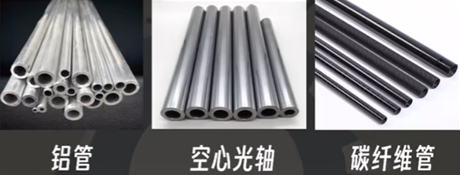 

**抗扭结构优化**：实际结构设计中，若碰到需要较大扭矩传动的情况，可以适当采用空心管件代替实心管件实现减重

## 2.10.弯曲相关计算

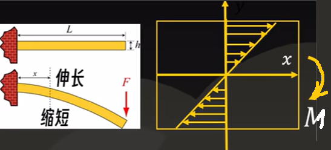 

与扭转类似，材料受弯的应力和变形也是不均匀的

弯曲是材料的上面受拉，下面受压(受到向下的弯矩时)。定义不发生拉伸、压缩的面为中性面，以中性面作为y轴的零点

假设存在角应变$\varphi '$(当材料受到弯曲时，端面出现倾斜，即总的角度变形量，除以材料的长度，得到角应变)

此时中性面两侧距离y处应变为：$\epsilon (y) = \varphi ' y$

中性面两侧距离y处应力为：$\sigma (y) = E \epsilon (y) = E \varphi ' y$

取微元dA，在y=y0处，绕z轴的弯曲力矩为：$dM_z (y) = \sigma (y) \cdot y dA = E \varphi ' y^2 dA$

沿y积分得到梁变形的弯曲力矩为：$M_z = \int _y E \varphi ' y^2 dA = E \varphi ' (\int _y y^2 dA)$

$\int _y y^2 dA$与截面形状有关，可用于衡量截面抗弯能力。

定义$I_z = \int _A y^2 dA$为截面的**==惯性矩==**，**承受弯曲载荷时，材料分布在离中心面两侧越远的地方，抗弯能力越强**

角应变量：$\varphi ' = \frac{M_z}{E I_z}$

最大应变：$\epsilon _{max} = \frac{M_z y}{E I_z}$

最大应力：$\sigma _{max} = \frac{M_Z y}{I_z}$

**==抗弯截面系数==**：$W = \frac{I_z}{y _{max}}$

常见截面的惯性矩和抗弯截面系数

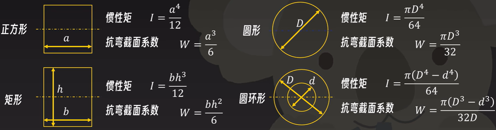 

例5：欧标2020铝型材的抗弯强度和抗弯刚度，分别等效于20mm宽，多厚的实心铝排？

> 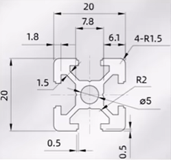 
>
>  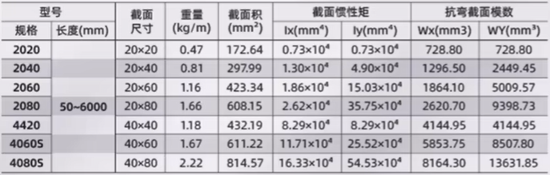 
>
> 解：
>
> 通过查表得惯性矩$I_x = 7300 mm^4$、抗弯截面系数$W_x = 728.8 mm^3$、截面面积$A = 172.64 mm^2$
>
> 抗弯强度等效铝排厚度：$h = \sqrt{\frac{6W}{b}} = \sqrt{\frac{6 \times 728.8 mm^3}{20 mm}} = 14.79mm$
>
> 此时铝排截面积：$20 mm \times 14.79 mm = 295.8 mm^2 , (1.71 \times)$
>
> 抗弯刚度等效铝排厚度：$h = \sqrt[3]{\frac{12I}{b}} = \sqrt[3]{\frac{12 \times 7300 mm^4}{20 mm}} = 16.36 mm$
>
> 此时铝排截面积：$20 mm \times 16.36 mm = 327.2 mm^2 , (1.90 \times)$
>
> 注意到：铝型材使用更少的材料实现了同样的抗弯强度和抗弯刚度
>
> 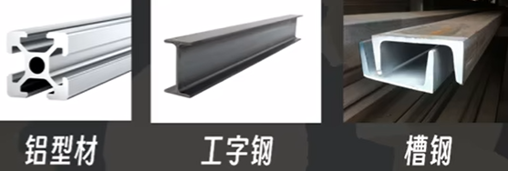 

**抗弯结构优化**：通过惯性矩可知，承受弯曲的零件要尽量让承受弯曲的截面材料分布在中性面两侧较远的地方。

很薄的==加强筋==增强能极大提升材料的抗弯能力。

使用CAD软件可以方便的计算出复杂截面材料的惯性矩(SolidWorks：评估--剖面属性)

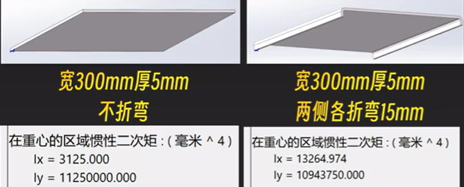 

(Ix表示x轴沿垂直于板面的方向，Iy表示y轴沿平面方向。对于一块板，受到垂直于板面的弯矩比受到沿着板面的扭矩更容易变形)

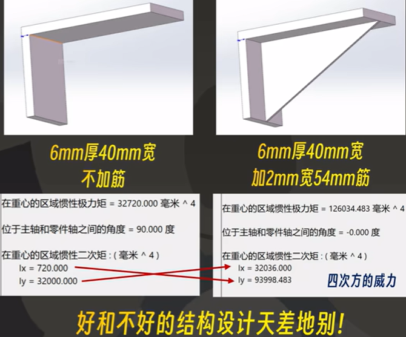 

梁的弯曲变形量称为**挠度**。挠度求解需要解微分方程，日常不需要这么精确的计算，只需对几种常见情况有了解即可。

**==简支梁==从变形量和应力上均远优于==悬臂梁==**

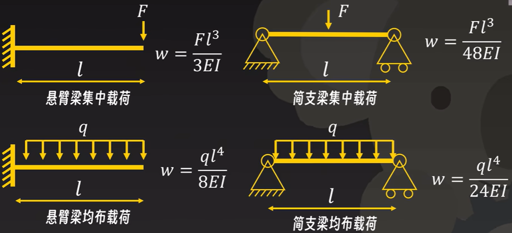 

## 2.11.超静定系统

理论力学不考虑材料变形因素，只能求解约束方程数等于变量数的系统，这种系统称为**==静定系统==**。

而对约束超过变量数的系统，也即**==超静定系统==**，无法求解

 

材料力学求解超静定系统的方法是根据材料情况，加入==变形协调方程==，使约束数等于方程数求解。

静定系统由于约束数恰好等于变量数，一旦其中有一个约束失效，结构就会失效。因此实际的结构设计中，为保证结构稳定，常常会使用到超静定系统。超静定会导致**过配合**，导致结构产生形变，对结构精度要求更高。

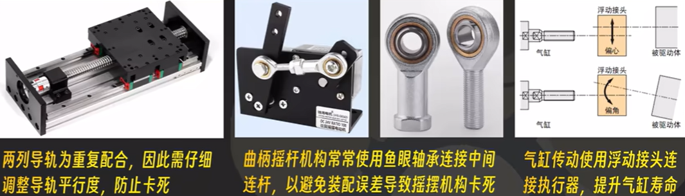 

## 2.12.==应力集中==

在受力截面积发生突变的地方，会产生**应力集中**现象。应力集中使材料的实际应力比按截面积计算得到的理论应力要大，**突变越剧烈，应力的变化越大**。

**设计中需要考虑尽可能减少应力集中造成的破坏(尤其是3d打印材料)**

可以用==有限元分析==，去知道结构的应力、应变失效的情况

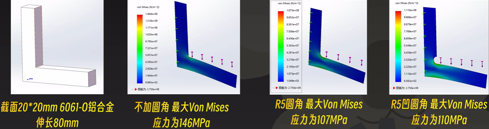 

其中，Von Mises应力为材料力学第三强度理论下复杂应力状态的等效应力

脆性材料需要尤其注意应力集中导致的破坏。

原型机快速制作中常用的脆性材料是激光切割亚克力，切割亚克力应尽可能避免出现==凹尖角(内锐角)==

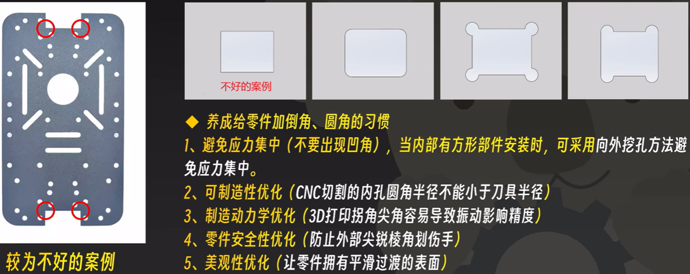

## 2.13.==压杆稳定==

细长杆件受压时，往往不是因为屈服失效，而是由于压杆失稳失效，因此受压杆件需要考虑压杆稳定

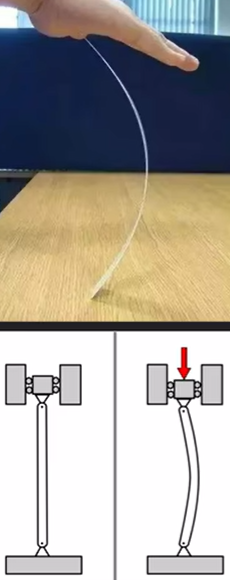 

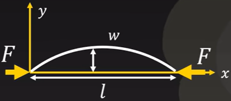 

弯矩公式：$M = -F w$

小变形情况下，挠曲线微分方程：$\frac{d^2 w}{d x^2} = \frac{M}{E I} = - \frac{F}{E I} w$

$\frac{d^2 w}{d x^2} + \frac{F}{E I} w = 0$二阶常系数线性微分方程

$w = A sin kx + B cos kx , k = \sqrt{\frac{F}{E I}}$

边界条件：$x = 0$时，$w = 0 \implies B = 0$

​                    $x = l$时，$w = 0 \implies A不能为0$，则$sin kl =0 , kl = n \pi$

临界状态：$kl = \pi \implies F = \frac{\pi ^2 E I}{l ^2}$

不同边界条件(约束)，结果不同。为了简化分析：$F _{cr} = \frac{\pi ^2 E I}{(ul) ^2}$，其中，$ul$--相当长度

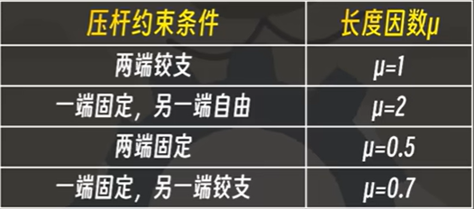 
